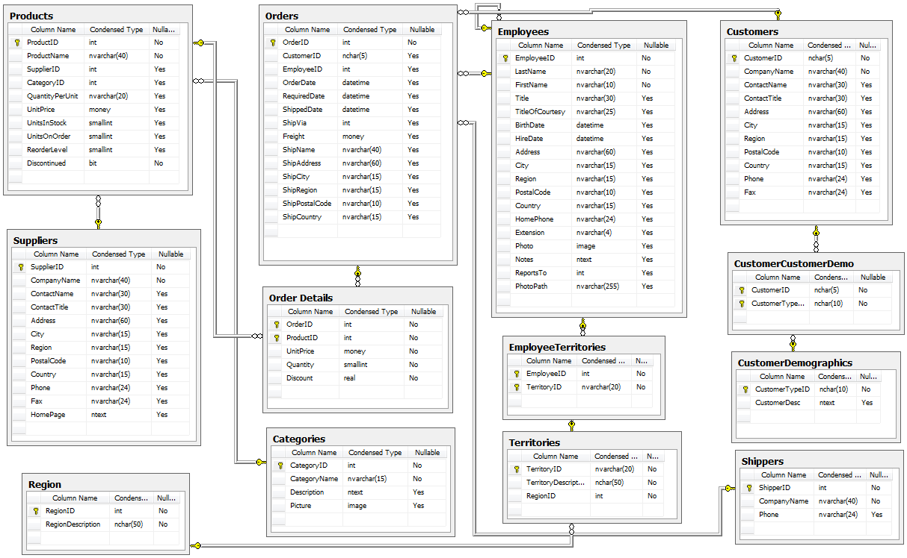
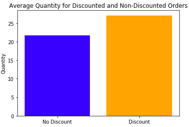
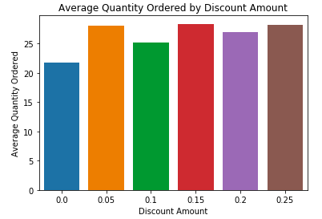
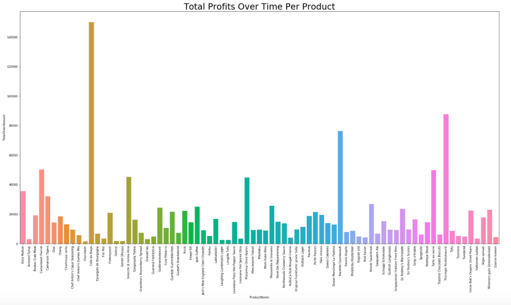
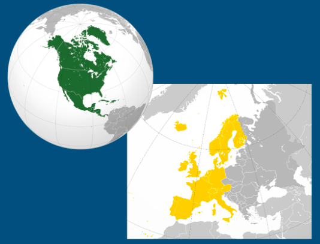
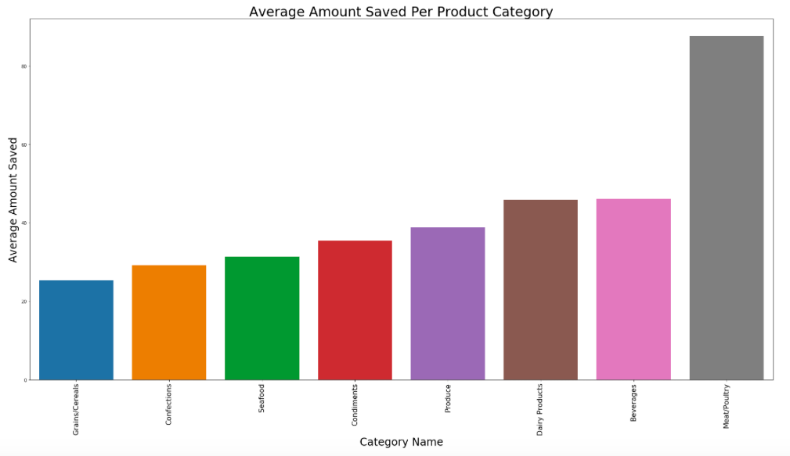

# Northwind Product Order Analysis

## Introduction

For this project, we'll be working with the Northwind database--a free, open-source dataset created by Microsoft containing data from a fictional company. The schema for the Northwind database can be examined below:

Our goal throughout this project is to practice gathering information from a real-world database and use your knowledge of statistical analysis and hypothesis testing to generate analytical insights that can be of value to the company. 

## Objectives

By employing the OSEMN (obtain, scrub, explore, model, and interpret) data science process and designing experiments for testing hypotheses about our data, we will answer the following questions with regards to the Northwind database:

* Do discounts have a statistically significant effect on the number of products customers order? If so, at what level(s) of discount?
* Which products have generaed the most profits over time? Does the unit price, average quantity ordered, or average discount provide the most statistically significant impact the profitability of a particular product?
* How does the region of the supplier affect the average order quantity? What about the customer's region?
* How does the region of the supplier affect the total price of the products ordered? What about the customer's region?
* Does the product category have a statistically significant effect on the unit price of available products? What about the category's effect on the typical details per order (amount saved, quantity, unit price, and discount)?

The above questions have significant business value for the Northwind company, as we explore how to best maximize profits given the value of discounts and differentiation between the different discount levels. Our additional research questions allow us to analyze specific product profitability, the strength of supplier/customer regions, and 

## Data Science Process 

Across the scope of the project, we touch upon various components of our data science process, depending on the research question at hand. However, the overall project from start to finish adheres to the OSEMN framework:

1. Obtain
2. Scrub
3. Explore
4. Model
5. Interpret

Furthermore, we will focus extensively on A/B testing as a method for exploring the data and statistical analysis. Our general process will progress through the following steps:

1. Identify the question
2. Define the null (Ho) and alternative (Ha) hypotheses
3. Generate the control and test data groupings
4. Run the experiment (two-sample t-test)
5. Analyze the results

## Significant Findings

**Discount Effect**

Discounts do have a statistically significant effect on the quantity of products ordered. The bar graph below displays the magnitude of this difference, with an average order quantity of 21.7 for non-discounted items and 27.1 for discounted items.

All levels of discount significantly increase the average quantity, although further research into less common discount levels (1%, 2%, 3%, 4%, and 6%) may be necessary. However, the level of the discount is not very influential in determining the quantity ordered. All discount levels appear to be weighted equally with regards to order quantity.

**Product Profitability**

A handful of products (Cote de Blaye, Raclette Courdavault, Thüringer Rostbratwurst, Tarte au sucre, Manjimup Dried Apples, Gnocchi di nonna Alice, and Camembert Pierrot) generate significantly more profits than any of the other 77 available products, as illustrated in the visualization below. Average unit price is a better predictor of these products' profitability over time than the total quantity of a product across all orders. The amount and frequency of discount has little to no influence over product profitability.

**Supplier/Customer Region**

Supplier region has little to no influence over order quantity, while customer region has significant influence over order quantity, with Western Europe and North America receiving the largest average orders.

Supplier region does significantly influence average order value, with Western Europe shipping orders that average over 400 dollars more than any other region. Customer region also significantly affects average order value (but to a much lower magnitude), with Western Europe and North America once again taking the lead.

**Product Category**

Unit prices between available products does not differ significantly based upon category, although the average unit price between ordered products does differ significantly, with meat/poultry orders at unit prices higher than any other category.

Customers also save the most on average from meat/poultry orders, as indicated by the significance of differences in the amount saved between product categories. The combination of these last two observations may indicate that the discounts on meat/poultry are extremely effective in generating additional profits!

## Future Work

Moving forward, it may be of company interest to investigate the following:

1. What is the optimal discount level for meat/poultry products to optimize their profitability over time?
2. Which suppliers within our regions of highest production are the most valuable? How can we increase their profibility and mirror this success in other regions as well?
3. If our lower performing supplier regions have reached maximum profitability without much room for growth, would it be financially logical (and feasible?) to transfer their services to a more effective supplier?
4. What factors in particular are causing the seven most profitable products to rise above the rest? Is this phenomenon replicable with other products as well?